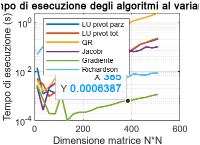
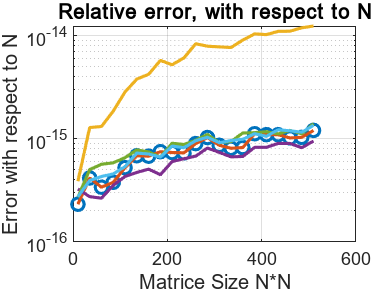
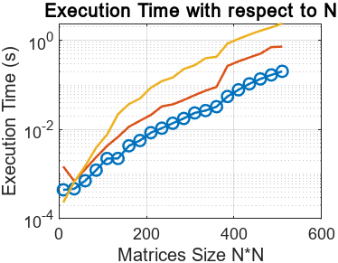
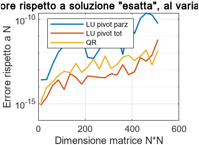
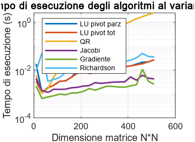
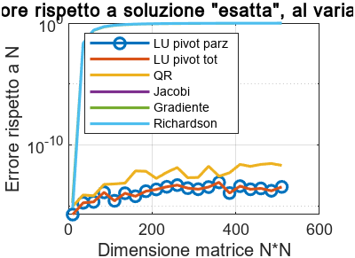

# Linear Systems Solvers: Benchmark & Physical Application

## Project Overview
This project performs a comparative analysis of direct and iterative numerical methods for solving linear systems ($Ax = b$).
The study focuses on **computational efficiency** and **numerical stability**, testing algorithms on both synthetic data and physical models (Poisson equation).
* **Course:** Numerical Methods (Grade: 30/30) 
* **Language:** MATLAB (Manual implementation of algorithms).

## Experimental Scenarios
The benchmark is structured into three distinct testing environments to isolate specific algorithmic behaviors:

### Test 1: Ideal Conditions (SPD Matrices)
* **Dataset:** Symmetric Positive Definite (SPD) matrices with diagonal dominance and low condition number ($K(A) \approx 1$).
* **Goal:** Benchmark baseline convergence speed for all methods.
* **Methods:** LU, QR, Jacobi, Richardson, Gradient Descent.

### Test 2: General Robustness (Random Matrices)
* **Dataset:** Random non-singular matrices (Non-SPD, lacking diagonal dominance).
* **Analysis:** Iterative methods were excluded due to theoretical non-convergence. The focus is on comparing **LU (Pivoting)** vs **QR (Householder)** stability.

### Test 3: Physical Modeling (Poisson Equation)
* **Problem:** 1D Elastic Wire problem modeled by the differential equation $-u''(x) = x$ on $[0, 1]$.
* **Discretization:** Finite Difference Method on $N+2$ points, resulting in an $N \times N$ sparse, ill-conditioned Poisson matrix.
* **Goal:** Stress-test solvers on a real-world ill-conditioned system arising from differential equations.

## Metrics & Visualization
For each scenario, the following metrics were plotted against matrix size ($N$):
1. **Execution Time:** Wall-clock time analysis.
2. **Relative Error:** Precision analysis ($||Ax_{calc} - b|| / ||b||$).

  

### Test 1: Ideal Scenario (SPD Matrices)
*Comparison on well-conditioned matrices where all methods converge.*
| Execution Time | Relative Error |
| :---: | :---: |
|  |  |

### Test 2: Random Matrices (General Case)
*Comparison on non-symmetric matrices. Iterative methods excluded due to divergence.*
| Execution Time | Relative Error |
| :---: | :---: |
|  |  |

### Test 3: Poisson Equation (Ill-Conditioned)
*Stress test on the Elastic Wire physical model.*
| Execution Time | Relative Error |
| :---: | :---: |
|  |  |

## Key Findings & Conclusions

### 1. Direct Methods: LU vs. QR
Contrary to the theoretical expectation that Householder QR is unconditionally stable, experimental results showed that **LU with Partial Pivoting** performed slightly better in terms of precision.
* **Reasoning:** QR factorization involves a significantly higher number of floating-point operations ($\approx 4n^3/3$) compared to LU ($\approx 2n^3/3$). In the tested scenarios, this led to a greater **accumulation of round-off errors**, making QR slightly less accurate than LU despite its orthogonality.

### 2. Pivoting Impact
The comparison between LU variants highlighted the necessity of pivoting.
* **LU with Partial Pivoting** achieved drastically lower relative errors compared to the naive implementation.
* **Cost/Benefit:** The computational overhead of row permutation was negligible, making Partial Pivoting the strictly superior choice for general systems.

### 3. Iterative Methods on Ill-Conditioned Systems (Poisson)
In Test 3 (Poisson Matrix), simple iterative methods like **Jacobi** technically converged but failed to reduce the error significantly (stalling at $\approx 10^0$).
* This confirms that for matrices with extremely high condition numbers ($K(A) \gg 1$), simple iterative schemes are ineffective without advanced preconditioning, regardless of iteration count.

### 4. Optimal Solvers
* **Best for SPD Matrices:** The **Gradient Descent** method proved to be by far the fastest algorithm in Test 1, maintaining high precision.
* **Best General Solver:** **LU with Partial Pivoting** emerged as the robust winner, offering the best trade-off between computational cost and numerical stability across all test cases.

---
*Author: Giovanni Adelfio, 02/07/2025*
